# Smart AI Generation Alert - VSCode Extension

[](https://github.com/smart-ai-alert/vscode-extension)
[](LICENSE)
[](https://code.visualstudio.com/)

> Intelligent notifications when AI code generation tasks are likely complete. Stay productive without constantly checking your editor.

## 🎯 Overview

The **Smart AI Generation Alert Extension** is a productivity tool designed for developers using AI code generation tools like GitHub Copilot, ChatGPT, or other AI coding assistants. It provides intelligent audible notifications when AI coding tasks are likely complete, helping you maintain focus and productivity.

### ✨ Key Features

- 🧠 **Smart Detection**: Monitors text changes and starts intelligent countdown timers
- 🚫 **Intelligent Suppression**: Avoids false alarms during active terminal use
- ⚙️ **Configurable Timing**: Customize countdown and threshold periods to match your workflow
- 🔊 **Cross-Platform Audio**: Reliable sound playback on Windows, macOS, and Linux
- 🪶 **Lightweight**: Minimal performance impact (<100ms activation, <1% CPU usage)
- 🎛️ **Easy Configuration**: Simple settings through VSCode preferences

## 🚀 Quick Start

### Installation

1. Open VSCode
2. Go to Extensions (`Ctrl+Shift+X` / `Cmd+Shift+X`)
3. Search for "Smart AI Generation Alert"
4. Click Install
5. Reload VSCode if prompted

### Basic Usage

1. **Enable the extension** (enabled by default)
2. **Start coding** with your AI assistant
3. **Make code changes** - extension detects and starts 15-second timer
4. **Use terminal** - timer automatically cancels (smart suppression)
5. **Return to editor** - new timer starts when you make changes
6. **Hear alert** - sound plays when timer completes without interruption

## ⚙️ Configuration

Access settings via `File > Preferences > Settings` and search for "AI Alert":

```json
{
    "aiAlert.enabled": true,
    "aiAlert.countdownSeconds": 15,
    "aiAlert.terminalUseThresholdSeconds": 10,
    "aiAlert.recentTerminalThresholdMinutes": 1
}
```

### Configuration Options

| Setting | Description | Default | Range |
|:--------|:------------|:--------|:------|
| `enabled` | Enable/disable extension | `true` | boolean |
| `countdownSeconds` | Delay after code change | `15` | 5-60 seconds |
| `terminalUseThresholdSeconds` | Terminal suppression window | `10` | 1-30 seconds |
| `recentTerminalThresholdMinutes` | Recent terminal activity window | `1` | 0.5-10 minutes |

## 🎮 Commands

Access via Command Palette (`Ctrl+Shift+P` / `Cmd+Shift+P`):

- **`AI Alert: Test Alert Sound`** - Test audio functionality
- **`AI Alert: Toggle Extension On/Off`** - Quick enable/disable

## 🏗️ How It Works

```mermaid
graph LR
    A[Code Change] --> B[Start 15s Timer]
    B --> C{Terminal Used?}
    C -->|Yes| D[Cancel Timer]
    C -->|No| E[🔊 Play Alert]
    F[User Activity] --> G[Reset Timer]
```



### Smart Suppression Logic

The extension intelligently suppresses alarms when:
- Terminal is activated within 10 seconds of code change
- Terminal was used within the last 1 minute
- User makes additional edits or cursor movements

## 📚 Documentation

Comprehensive documentation is available in the [`docs/`](docs/) folder:

- **[User Guide](docs/user-guide.md)** - Installation, configuration, and usage
- **[Development Guide](docs/development-guide.md)** - Setup and development workflow
- **[Implementation Flow](docs/implementation-flow.md)** - Architecture and task workflow
- **[Testing Strategy](docs/testing-strategy.md)** - Testing approach and procedures
- **[Requirements](docs/requirements.md)** - Functional and technical requirements
- **[Technical Specification](docs/technical-specification.md)** - Detailed technical design

## 🛠️ Development

### Prerequisites

- Node.js 16.x or higher
- VSCode 1.74.0 or higher
- npm 8.x or higher

### Setup

```bash
# Clone repository
git clone https://github.com/smart-ai-alert/vscode-extension.git
cd vscode-extension

# Install dependencies
npm install

# Compile TypeScript
npm run compile

# Run in development mode
npm run watch
```

### Development Workflow

1. **Start development**: `npm run watch`
2. **Debug extension**: Press `F5` in VSCode
3. **Run tests**: `npm run test`
4. **Package extension**: `npm run package`

See [Development Guide](docs/development-guide.md) for detailed instructions.

## 🧪 Testing

### Running Tests

```bash
# Run all tests
npm run test

# Run with coverage
npm run test:coverage

# Run linting
npm run lint
```

### Test Coverage

- **Target**: 95% code coverage
- **Unit Tests**: Component logic validation
- **Integration Tests**: End-to-end workflow testing
- **Manual Tests**: Cross-platform compatibility

## 📊 Project Status

### ✅ Phase 1: Foundation (Complete)
- [x] Project structure and TypeScript configuration
- [x] Extension manifest with configuration schema
- [x] Development environment setup
- [x] Core type definitions and architecture
- [x] Comprehensive documentation

### 🔄 Current Phase: Implementation
- [ ] Configuration management system
- [ ] Event handling implementation
- [ ] Core alarm logic development
- [ ] Cross-platform sound playback
- [ ] Testing suite development

### ⏳ Upcoming Phases
- Testing and quality assurance
- Documentation finalization
- Marketplace preparation and publishing

## 🤝 Contributing

We welcome contributions! Please see our [Development Guide](docs/development-guide.md) for:

- Setting up the development environment
- Code style and conventions
- Testing requirements
- Pull request process

### Ways to Contribute

- 🐛 **Bug Reports**: Report issues with detailed reproduction steps
- 💡 **Feature Requests**: Suggest new features or improvements
- 📝 **Documentation**: Improve or expand documentation
- 🧪 **Testing**: Help test on different platforms and scenarios
- 💻 **Code**: Implement features or fix bugs

## 📄 License

This project is licensed under the MIT License - see the [LICENSE](LICENSE) file for details.

## 🙏 Acknowledgments

- VSCode Extension API team for excellent documentation
- AI coding tool developers for inspiring this productivity enhancement
- Open source community for tools and libraries used in this project

## 📞 Support

- **Documentation**: Check the [docs/](docs/) folder for comprehensive guides
- **Issues**: Report bugs or request features on [GitHub Issues](https://github.com/smart-ai-alert/vscode-extension/issues)
- **Discussions**: Join community discussions for usage tips and feedback

---

**Made with ❤️ for the AI-assisted development community**

*Boost your productivity with intelligent notifications that respect your workflow.*
