# Implementation Flow Documentation

**Document ID:** IMPL-FLOW-AI-ALERT-1.0  
**Project Name:** Smart AI Generation Alert Extension  
**Date:** December 2024  
**Version:** 1.0

## 1.0 Current Project Architecture

### 1.1 Module Structure Overview

```
codeAlarm/
├── docs/                           # Documentation
│   ├── README.md                   # Project overview
│   ├── requirements.md             # Functional requirements
│   ├── technical-specification.md  # Technical design
│   ├── implementation-plan.md      # Development plan
│   ├── implementation-flow.md      # This document
│   ├── testing-strategy.md         # Testing documentation
│   ├── development-guide.md        # Developer setup guide
│   └── user-guide.md              # End user documentation
├── src/                           # Source code
│   ├── extension.ts               # ✅ Main extension entry point
│   ├── types.ts                   # ✅ TypeScript type definitions
│   ├── configManager.ts           # 🔄 Configuration management (placeholder)
│   ├── alarmManager.ts            # 🔄 Core alarm logic (placeholder)
│   ├── eventHandlers.ts           # 🔄 VSCode event handlers (placeholder)
│   └── soundManager.ts            # ⏳ Sound playback system (not created)
├── test/                          # ⏳ Test suite (not created)
├── out/                           # ✅ Compiled JavaScript output
├── .vscode/                       # ✅ VSCode configuration
├── package.json                   # ✅ Extension manifest
├── tsconfig.json                  # ✅ TypeScript configuration
├── .eslintrc.json                 # ✅ ESLint configuration
├── .gitignore                     # ✅ Git ignore rules
└── .vscodeignore                  # ✅ Package ignore rules

Legend: ✅ Complete | 🔄 In Progress | ⏳ Planned
```

### 1.2 Component Architecture


### 1.3 Data Flow Architecture

```mermaid
sequenceDiagram
    participant U as User
    participant E as EventHandlers
    participant A as AlarmManager
    participant C as ConfigManager
    participant S as SoundManager
    
    U->>E: Code Change
    E->>A: handleCodeChange()
    A->>C: getCountdownSeconds()
    C-->>A: 15 seconds
    A->>A: startTimer(15s)
    
    Note over A: 15 second countdown
    
    U->>E: Terminal Focus
    E->>A: handleTerminalFocus()
    A->>A: clearTimer()
    
    Note over A: Timer cancelled due to terminal activity
    
    U->>E: Code Change (again)
    E->>A: handleCodeChange()
    A->>A: startTimer(15s)
    
    Note over A: Timer expires without interruption
    
    A->>A: runAlarmChecks()
    A->>A: checkSuppressionConditions()
    A->>S: triggerAlarm()
    S->>U: 🔊 Alert Sound
```



## 2.0 Implementation Workflow

### 2.1 Task Dependencies Graph


### 2.2 Implementation Status

| Task | Status | Progress | Dependencies | Estimated Duration |
|:-----|:-------|:---------|:-------------|:-------------------|
| **Task 1: Initialize Project Structure** | ✅ Complete | 100% | None | 1-2 days |
| **Task 2: Configuration Management** | ⏳ Pending | 0% | Task 1 | 1 day |
| **Task 3: Event Handling System** | ⏳ Pending | 0% | Task 1, 2 | 2-3 days |
| **Task 4: Core Alarm Logic** | ⏳ Pending | 0% | Task 1, 2, 3 | 2-3 days |
| **Task 5: Sound Playback** | ⏳ Pending | 0% | Task 4 | 1-2 days |
| **Task 6: Extension Lifecycle** | ⏳ Pending | 0% | Task 4, 5 | 1 day |
| **Task 7: Testing Suite** | ⏳ Pending | 0% | Task 6 | 2-3 days |
| **Task 8: Documentation & Packaging** | 🔄 In Progress | 25% | Task 7 | 1-2 days |

## 3.0 Code Organization Patterns

### 3.1 File Naming Conventions

- **PascalCase** for class names: `AlarmManager`, `ConfigManager`
- **camelCase** for file names: `alarmManager.ts`, `configManager.ts`
- **kebab-case** for package and extension names: `smart-ai-generation-alert`
- **UPPER_CASE** for constants: `DEFAULT_CONFIG`, `LOG_LEVEL`

### 3.2 Import/Export Patterns

```typescript
// types.ts - Central type definitions
export interface AlarmConfig { ... }
export enum LogLevel { ... }
export const DEFAULT_CONFIG: AlarmConfig = { ... };

// configManager.ts - Class-based modules
export class ConfigManager {
    constructor() { ... }
    public getConfiguration(): AlarmConfig { ... }
}

// extension.ts - Main entry point
import * as vscode from 'vscode';
import { ConfigManager } from './configManager';
import { AlarmManager } from './alarmManager';
import { LogLevel } from './types';
```

### 3.3 Error Handling Patterns

```typescript
// Consistent error handling across all modules
try {
    // Operation that might fail
    const result = await riskyOperation();
    logMessage(LogLevel.INFO, 'Operation successful');
    return result;
} catch (error) {
    logMessage(LogLevel.ERROR, `Operation failed: ${error}`);
    // Graceful degradation or user notification
    vscode.window.showErrorMessage('Operation failed');
    return defaultValue;
}
```

## 4.0 Integration Points

### 4.1 ConfigManager Integration

**Purpose**: Centralized configuration management  
**Integration Points**:
- Extension activation: Load initial configuration
- Configuration changes: Real-time updates to all components
- Validation: Ensure settings are within acceptable ranges

```typescript
// Integration pattern
class AlarmManager {
    constructor(private configManager: ConfigManager) {
        this.configManager.onConfigurationChanged(() => {
            this.updateConfiguration();
        });
    }
}
```

### 4.2 EventHandlers Integration

**Purpose**: VSCode API event routing  
**Integration Points**:
- Text document changes → AlarmManager.handleCodeChange()
- Editor selection changes → AlarmManager.handleUserActivity()
- Terminal focus changes → AlarmManager.handleTerminalFocus()

```typescript
// Integration pattern
class EventHandlers {
    constructor(private alarmManager: AlarmManager) {
        this.setupEventListeners();
    }
    
    private handleTextDocumentChange(event: vscode.TextDocumentChangeEvent) {
        if (this.isRelevantChange(event)) {
            this.alarmManager.handleCodeChange();
        }
    }
}
```

### 4.3 AlarmManager Integration

**Purpose**: Core business logic coordination  
**Integration Points**:
- Receives events from EventHandlers
- Gets configuration from ConfigManager
- Triggers sound through SoundManager
- Manages timer lifecycle and state

```typescript
// Integration pattern
class AlarmManager {
    constructor(
        private configManager: ConfigManager,
        private soundManager: SoundManager
    ) { ... }
    
    private async triggerAlarm(): Promise<void> {
        try {
            await this.soundManager.playAlertSound();
            logMessage(LogLevel.INFO, 'Alarm triggered successfully');
        } catch (error) {
            logMessage(LogLevel.ERROR, `Alarm failed: ${error}`);
        }
    }
}
```

### 4.4 SoundManager Integration

**Purpose**: Cross-platform audio playback  
**Integration Points**:
- Called by AlarmManager when alarm conditions are met
- Platform detection and strategy selection
- Fallback mechanisms for reliability

```typescript
// Integration pattern
class SoundManager {
    public async playAlertSound(): Promise<void> {
        const strategies = this.getPlaybackStrategies();
        
        for (const strategy of strategies) {
            try {
                await strategy.play();
                return; // Success
            } catch (error) {
                logMessage(LogLevel.WARN, `Strategy ${strategy.name} failed: ${error}`);
            }
        }
        
        throw new Error('All sound playback strategies failed');
    }
}
```

## 5.0 Next Steps

### 5.1 Immediate Actions (Next Task)
1. **Execute Task 2: Configuration Management System**
   - Implement ConfigManager class with full functionality
   - Add configuration validation and change monitoring
   - Test configuration loading and updates

### 5.2 Critical Path Items
1. **Core Functionality** (Tasks 2-4): Essential for basic operation
2. **Sound Playback** (Task 5): Critical for user experience
3. **Testing** (Task 7): Required for quality assurance

### 5.3 Risk Mitigation
- **Timer Accuracy**: Implement high-resolution timestamps
- **Cross-Platform Compatibility**: Test on all target platforms early
- **Performance Impact**: Monitor and optimize throughout development

---

**Last Updated:** December 2024  
**Document Version:** 1.0  
**Implementation Status:** Phase 1 Complete (Project Structure)
