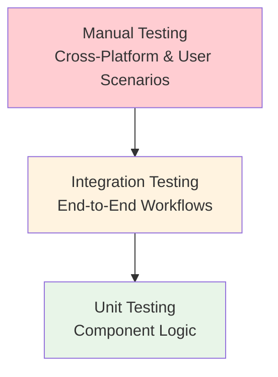

# Testing Strategy Documentation

**Document ID:** TEST-STRATEGY-AI-ALERT-1.0  
**Project Name:** Smart AI Generation Alert Extension  
**Date:** December 2024  
**Version:** 1.0

## 1.0 Testing Overview

### 1.1 Testing Objectives

- **Functional Correctness**: Verify all requirements (FR-01 to FR-07) are met
- **Performance Compliance**: Ensure <100ms activation time and <1% CPU usage
- **Cross-Platform Compatibility**: Validate on Windows, macOS, and Linux
- **Reliability**: Test error handling and edge cases
- **User Experience**: Validate intuitive operation and configuration

### 1.2 Testing Pyramid



### 1.3 Coverage Targets

| Test Type | Coverage Target | Current Status |
|:----------|:----------------|:---------------|
| **Unit Tests** | 95% code coverage | ⏳ Planned |
| **Integration Tests** | 100% workflow coverage | ⏳ Planned |
| **Manual Tests** | 100% platform coverage | ⏳ Planned |
| **Performance Tests** | All NFR requirements | ⏳ Planned |

## 2.0 Unit Testing Strategy

### 2.1 AlarmManager Testing

**Test File**: `test/suite/alarmManager.test.ts`

#### 2.1.1 Timer Logic Tests

```typescript
describe('AlarmManager Timer Logic', () => {
    let alarmManager: AlarmManager;
    let mockConfig: AlarmConfig;
    
    beforeEach(() => {
        mockConfig = { countdownSeconds: 15, ... };
        alarmManager = new AlarmManager(mockConfig);
    });
    
    test('should start 15-second countdown on code change', async () => {
        const startTime = Date.now();
        alarmManager.handleCodeChange();
        
        // Verify timer is set
        expect(alarmManager.hasActiveTimer()).toBe(true);
        
        // Wait for timer completion
        await new Promise(resolve => setTimeout(resolve, 15100));
        
        const elapsed = Date.now() - startTime;
        expect(elapsed).toBeGreaterThanOrEqual(15000);
        expect(elapsed).toBeLessThan(16000);
    });
    
    test('should reset timer on user activity', () => {
        alarmManager.handleCodeChange();
        expect(alarmManager.hasActiveTimer()).toBe(true);
        
        alarmManager.handleUserActivity();
        expect(alarmManager.hasActiveTimer()).toBe(false);
    });
});
```

#### 2.1.2 Suppression Logic Tests

```typescript
describe('AlarmManager Suppression Logic', () => {
    test('should suppress alarm for immediate terminal use', () => {
        const now = Date.now();
        alarmManager.handleCodeChange();
        
        // Simulate terminal focus within 10 seconds
        setTimeout(() => {
            alarmManager.handleTerminalFocus();
        }, 5000);
        
        // Verify alarm is suppressed
        expect(alarmManager.shouldTriggerAlarm()).toBe(false);
    });
    
    test('should suppress alarm for recent terminal activity', () => {
        // Set recent terminal activity (within 1 minute)
        alarmManager.handleTerminalFocus();
        
        // Wait 30 seconds, then trigger code change
        setTimeout(() => {
            alarmManager.handleCodeChange();
            expect(alarmManager.shouldTriggerAlarm()).toBe(false);
        }, 30000);
    });
});
```

### 2.2 ConfigManager Testing

**Test File**: `test/suite/configManager.test.ts`

#### 2.2.1 Configuration Loading Tests

```typescript
describe('ConfigManager Configuration Loading', () => {
    let configManager: ConfigManager;
    
    beforeEach(() => {
        configManager = new ConfigManager();
    });
    
    test('should load default configuration', () => {
        const config = configManager.getConfiguration();
        
        expect(config.enabled).toBe(true);
        expect(config.countdownSeconds).toBe(15);
        expect(config.terminalUseThresholdSeconds).toBe(10);
        expect(config.recentTerminalThresholdMinutes).toBe(1);
    });
    
    test('should validate configuration ranges', () => {
        // Test invalid values
        const invalidConfig = {
            countdownSeconds: 100, // Max is 60
            terminalUseThresholdSeconds: 0, // Min is 1
        };
        
        const validatedConfig = configManager.validateConfiguration(invalidConfig);
        
        expect(validatedConfig.countdownSeconds).toBe(60);
        expect(validatedConfig.terminalUseThresholdSeconds).toBe(1);
    });
});
```

### 2.3 EventHandlers Testing

**Test File**: `test/suite/eventHandlers.test.ts`

#### 2.3.1 Event Filtering Tests

```typescript
describe('EventHandlers Event Filtering', () => {
    let eventHandlers: EventHandlers;
    let mockAlarmManager: jest.Mocked<AlarmManager>;
    
    beforeEach(() => {
        mockAlarmManager = createMockAlarmManager();
        eventHandlers = new EventHandlers(mockAlarmManager);
    });
    
    test('should filter out non-code document changes', () => {
        const outputChannelEvent = createMockTextDocumentChangeEvent({
            uri: vscode.Uri.parse('output:extension-output'),
            languageId: 'log'
        });
        
        eventHandlers.handleTextDocumentChange(outputChannelEvent);
        
        expect(mockAlarmManager.handleCodeChange).not.toHaveBeenCalled();
    });
    
    test('should process code file changes', () => {
        const codeFileEvent = createMockTextDocumentChangeEvent({
            uri: vscode.Uri.file('/path/to/file.ts'),
            languageId: 'typescript'
        });
        
        eventHandlers.handleTextDocumentChange(codeFileEvent);
        
        expect(mockAlarmManager.handleCodeChange).toHaveBeenCalledTimes(1);
    });
});
```

### 2.4 SoundManager Testing

**Test File**: `test/suite/soundManager.test.ts`

#### 2.4.1 Platform Detection Tests

```typescript
describe('SoundManager Platform Detection', () => {
    let soundManager: SoundManager;
    
    test('should detect Windows platform', () => {
        Object.defineProperty(process, 'platform', { value: 'win32' });
        soundManager = new SoundManager();
        
        expect(soundManager.getCurrentPlatform()).toBe(Platform.WINDOWS);
    });
    
    test('should select appropriate playback strategy', () => {
        const strategies = soundManager.getPlaybackStrategies();
        
        expect(strategies).toHaveLength(3);
        expect(strategies[0].name).toBe('system_bell');
        expect(strategies[1].name).toBe('notification_api');
        expect(strategies[2].name).toBe('platform_command');
    });
});
```

## 3.0 Integration Testing Strategy

### 3.1 End-to-End Workflow Tests

**Test File**: `test/suite/integration.test.ts`

#### 3.1.1 Complete Alarm Workflow

```typescript
describe('Complete Alarm Workflow', () => {
    let extension: ExtensionContext;
    
    beforeEach(async () => {
        extension = await activateExtension();
    });
    
    test('should trigger alarm after code change and countdown', async () => {
        const soundSpy = jest.spyOn(extension.soundManager, 'playAlertSound');
        
        // Simulate code change
        await simulateTextDocumentChange();
        
        // Wait for countdown completion
        await new Promise(resolve => setTimeout(resolve, 15100));
        
        expect(soundSpy).toHaveBeenCalledTimes(1);
    });
    
    test('should suppress alarm on terminal activity', async () => {
        const soundSpy = jest.spyOn(extension.soundManager, 'playAlertSound');
        
        // Simulate code change
        await simulateTextDocumentChange();
        
        // Simulate terminal focus within threshold
        setTimeout(() => simulateTerminalFocus(), 5000);
        
        // Wait for countdown completion
        await new Promise(resolve => setTimeout(resolve, 15100));
        
        expect(soundSpy).not.toHaveBeenCalled();
    });
});
```

### 3.2 Configuration Change Tests

```typescript
describe('Configuration Change Integration', () => {
    test('should apply configuration changes immediately', async () => {
        // Change countdown duration
        await vscode.workspace.getConfiguration('aiAlert')
            .update('countdownSeconds', 30);
        
        const config = extension.configManager.getConfiguration();
        expect(config.countdownSeconds).toBe(30);
        
        // Verify alarm manager uses new duration
        extension.alarmManager.handleCodeChange();
        expect(extension.alarmManager.getCountdownDuration()).toBe(30000);
    });
});
```

## 4.0 Manual Testing Procedures

### 4.1 Cross-Platform Testing Checklist

#### 4.1.1 Windows Testing

- [ ] Extension activates without errors
- [ ] Sound playback works (system bell, notification)
- [ ] Configuration changes apply correctly
- [ ] Performance meets requirements (<100ms activation)
- [ ] No memory leaks after extended use

#### 4.1.2 macOS Testing

- [ ] Extension activates without errors
- [ ] Sound playback works (afplay command, system bell)
- [ ] Configuration changes apply correctly
- [ ] Performance meets requirements
- [ ] Proper cleanup on deactivation

#### 4.1.3 Linux Testing

- [ ] Extension activates without errors
- [ ] Sound playback works (aplay/paplay, system bell)
- [ ] Configuration changes apply correctly
- [ ] Performance meets requirements
- [ ] Compatibility with different distributions

### 4.2 User Scenario Testing

#### 4.2.1 Typical AI Coding Session

```
Scenario: Developer using AI code generation
1. Open VSCode with extension enabled
2. Start AI code generation in editor
3. Switch to terminal to run commands
4. Return to editor to review generated code
5. Make manual edits to the code

Expected: No false alarms during terminal use,
         alarm triggers when returning to review code
```

#### 4.2.2 Configuration Testing

```
Scenario: User customizes timing settings
1. Open VSCode settings
2. Navigate to AI Alert configuration
3. Change countdown to 30 seconds
4. Change terminal threshold to 5 seconds
5. Test with code changes and terminal use

Expected: New timing values are applied immediately,
         behavior matches new configuration
```

## 5.0 Performance Testing Guidelines

### 5.1 Activation Time Testing

```typescript
describe('Performance Tests', () => {
    test('extension activation should be under 100ms', async () => {
        const startTime = performance.now();
        
        await vscode.extensions.getExtension('smart-ai-alert.smart-ai-generation-alert')
            ?.activate();
        
        const activationTime = performance.now() - startTime;
        expect(activationTime).toBeLessThan(100);
    });
});
```

### 5.2 CPU Usage Monitoring

```bash
# Monitor CPU usage during extension operation
# Run for 10 minutes with typical usage patterns

# Windows
wmic process where name="Code.exe" get ProcessId,PageFileUsage,WorkingSetSize

# macOS/Linux
top -p $(pgrep "Code")
```

### 5.3 Memory Leak Detection

```typescript
describe('Memory Leak Tests', () => {
    test('should not leak memory after multiple alarm cycles', async () => {
        const initialMemory = process.memoryUsage().heapUsed;
        
        // Simulate 100 alarm cycles
        for (let i = 0; i < 100; i++) {
            await simulateAlarmCycle();
        }
        
        // Force garbage collection
        if (global.gc) global.gc();
        
        const finalMemory = process.memoryUsage().heapUsed;
        const memoryIncrease = finalMemory - initialMemory;
        
        // Allow for some memory growth but not excessive
        expect(memoryIncrease).toBeLessThan(10 * 1024 * 1024); // 10MB
    });
});
```

## 6.0 Test Coverage Measurement

### 6.1 Coverage Tools Setup

```json
// package.json - Add coverage scripts
{
  "scripts": {
    "test": "jest",
    "test:coverage": "jest --coverage",
    "test:watch": "jest --watch"
  },
  "jest": {
    "collectCoverageFrom": [
      "src/**/*.ts",
      "!src/**/*.d.ts"
    ],
    "coverageThreshold": {
      "global": {
        "branches": 95,
        "functions": 95,
        "lines": 95,
        "statements": 95
      }
    }
  }
}
```

### 6.2 Coverage Reporting

```bash
# Generate coverage report
npm run test:coverage

# View HTML coverage report
open coverage/lcov-report/index.html
```

## 7.0 Continuous Integration Testing

### 7.1 GitHub Actions Workflow

```yaml
# .github/workflows/test.yml
name: Test Suite

on: [push, pull_request]

jobs:
  test:
    runs-on: ${{ matrix.os }}
    strategy:
      matrix:
        os: [ubuntu-latest, windows-latest, macos-latest]
        node-version: [16.x, 18.x]
    
    steps:
    - uses: actions/checkout@v3
    - name: Use Node.js ${{ matrix.node-version }}
      uses: actions/setup-node@v3
      with:
        node-version: ${{ matrix.node-version }}
    
    - run: npm ci
    - run: npm run compile
    - run: npm run lint
    - run: npm run test:coverage
    
    - name: Upload coverage to Codecov
      uses: codecov/codecov-action@v3
```

---

**Last Updated:** December 2024  
**Document Version:** 1.0  
**Testing Status:** Strategy Defined, Implementation Pending
