# User Installation and Usage Guide

**Document ID:** USER-GUIDE-AI-ALERT-1.0  
**Project Name:** Smart AI Generation Alert Extension  
**Date:** December 2024  
**Version:** 1.0

## 1.0 Overview

The **Smart AI Generation Alert Extension** is a productivity tool for developers using AI code generation. It provides intelligent audible notifications when AI coding tasks are likely complete, helping you stay focused without constantly checking the editor.

### 1.1 Key Features

- 🎯 **Smart Detection**: Monitors text changes and starts countdown timers
- 🧠 **Intelligent Suppression**: Avoids false alarms during active terminal use
- ⚙️ **Configurable Timing**: Customize countdown and threshold periods
- 🔊 **Cross-Platform Audio**: Works on Windows, macOS, and Linux
- 🪶 **Lightweight**: Minimal performance impact on VSCode

### 1.2 How It Works

```mermaid
graph LR
    A[Code Change] --> B[15s Countdown]
    B --> C{Terminal Active?}
    C -->|Yes| D[Suppress Alarm]
    C -->|No| E[🔊 Alert Sound]
    F[User Activity] --> G[Reset Timer]
```



## 2.0 Installation

### 2.1 From VSCode Marketplace (Recommended)

1. **Open VSCode**
2. **Go to Extensions** (`Ctrl+Shift+X` / `Cmd+Shift+X`)
3. **Search**: "Smart AI Generation Alert"
4. **Click Install** on the extension by "smart-ai-alert"
5. **Reload VSCode** if prompted

### 2.2 From VSIX File

```bash
# Install from downloaded .vsix file
code --install-extension smart-ai-generation-alert-1.0.0.vsix
```

### 2.3 Installation Verification

1. **Check Extension List**: `Extensions: Show Installed Extensions`
2. **Look for**: "Smart AI Generation Alert" with ✅ enabled status
3. **Test Command**: Open Command Palette (`Ctrl+Shift+P`) and type "AI Alert"

## 3.0 Configuration

### 3.1 Accessing Settings

#### Method 1: VSCode Settings UI
1. **Open Settings**: `File > Preferences > Settings` (`Ctrl+,`)
2. **Search**: "AI Alert" or "Smart AI Generation Alert"
3. **Modify**: Adjust values using the UI controls

#### Method 2: Settings JSON
1. **Open Settings JSON**: `Ctrl+Shift+P` → "Preferences: Open Settings (JSON)"
2. **Add Configuration**:
```json
{
    "aiAlert.enabled": true,
    "aiAlert.countdownSeconds": 15,
    "aiAlert.terminalUseThresholdSeconds": 10,
    "aiAlert.recentTerminalThresholdMinutes": 1
}
```

### 3.2 Configuration Options

| Setting | Description | Default | Range | Example Use Case |
|:--------|:------------|:--------|:------|:-----------------|
| **`aiAlert.enabled`** | Enable/disable the extension | `true` | `true`/`false` | Temporarily disable during presentations |
| **`aiAlert.countdownSeconds`** | Delay after code change before alarm | `15` | 5-60 seconds | Longer for slow AI models |
| **`aiAlert.terminalUseThresholdSeconds`** | Window after code change where terminal suppresses alarm | `10` | 1-30 seconds | Adjust for workflow patterns |
| **`aiAlert.recentTerminalThresholdMinutes`** | Look-back period for recent terminal activity | `1` | 0.5-10 minutes | Longer for complex terminal workflows |

### 3.3 Configuration Examples

#### For Fast AI Models (GitHub Copilot)
```json
{
    "aiAlert.countdownSeconds": 10,
    "aiAlert.terminalUseThresholdSeconds": 5,
    "aiAlert.recentTerminalThresholdMinutes": 0.5
}
```

#### For Slow AI Models (Complex Generation)
```json
{
    "aiAlert.countdownSeconds": 30,
    "aiAlert.terminalUseThresholdSeconds": 15,
    "aiAlert.recentTerminalThresholdMinutes": 2
}
```

#### For Terminal-Heavy Workflows
```json
{
    "aiAlert.countdownSeconds": 15,
    "aiAlert.terminalUseThresholdSeconds": 20,
    "aiAlert.recentTerminalThresholdMinutes": 5
}
```

## 4.0 Usage Scenarios

### 4.1 Typical AI Coding Session

#### Scenario: Using AI Code Generation

```
1. 📝 Start AI code generation (Copilot, ChatGPT, etc.)
2. ⏱️ Extension detects code changes, starts 15-second timer
3. 💻 You switch to terminal to run tests/commands
4. 🚫 Timer is cancelled (terminal activity detected)
5. 📝 Return to editor, make more changes
6. ⏱️ New 15-second timer starts
7. 🔊 Timer completes → Alert sound plays
8. ✅ You return attention to review generated code
```

#### Expected Behavior

- ✅ **No false alarms** during active terminal use
- ✅ **Reliable notifications** when you step away from editor
- ✅ **Immediate response** to configuration changes
- ✅ **Minimal performance impact** on VSCode

### 4.2 Advanced Usage Patterns

#### Long-Running AI Generation

```
Use Case: Complex code generation taking 30+ seconds
Configuration: Increase countdownSeconds to 45
Benefit: Avoid premature alarms for slow AI responses
```

#### Rapid Development Cycles

```
Use Case: Quick iterations with frequent terminal use
Configuration: Increase terminalUseThresholdSeconds to 20
Benefit: Reduce alarm suppression for brief terminal checks
```

#### Multi-Terminal Workflows

```
Use Case: Multiple terminals for different purposes
Configuration: Increase recentTerminalThresholdMinutes to 3
Benefit: Account for complex terminal switching patterns
```

## 5.0 Command Palette Commands

### 5.1 Available Commands

Access via Command Palette (`Ctrl+Shift+P` / `Cmd+Shift+P`):

#### `AI Alert: Test Alert Sound`
- **Purpose**: Test audio playback functionality
- **Usage**: Verify sound works on your system
- **Expected**: Immediate alert sound playback

#### `AI Alert: Toggle Extension On/Off`
- **Purpose**: Quickly enable/disable extension
- **Usage**: Temporary disable during meetings/presentations
- **Expected**: Status notification showing current state

### 5.2 Command Usage Examples

```bash
# Test sound functionality
> AI Alert: Test Alert Sound
# Result: Plays alert sound immediately

# Toggle extension state
> AI Alert: Toggle Extension On/Off
# Result: Shows "Smart AI Generation Alert enabled/disabled"
```

## 6.0 Troubleshooting

### 6.1 Common Issues

#### Issue: No Sound Playing

**Symptoms**: Extension active but no audio alerts

**Solutions**:
1. **Test Sound**: Use "AI Alert: Test Alert Sound" command
2. **Check System Volume**: Ensure system audio is not muted
3. **Platform-Specific**:
   - **Windows**: Check Windows sound settings
   - **macOS**: Check System Preferences > Sound
   - **Linux**: Verify ALSA/PulseAudio configuration

#### Issue: Too Many False Alarms

**Symptoms**: Alarms trigger during active work

**Solutions**:
1. **Increase Terminal Threshold**: Raise `terminalUseThresholdSeconds`
2. **Increase Recent Terminal Window**: Raise `recentTerminalThresholdMinutes`
3. **Check Workflow**: Ensure you're using terminal regularly

#### Issue: Missing Alarms

**Symptoms**: No alarms when expected

**Solutions**:
1. **Check Extension Status**: Verify extension is enabled
2. **Verify Configuration**: Check `aiAlert.enabled` is `true`
3. **Test with Simple Case**: Make code change, wait without terminal use

### 6.2 Performance Issues

#### Issue: VSCode Feels Slow

**Symptoms**: Noticeable performance impact

**Solutions**:
1. **Check Extension Status**: Disable temporarily to verify cause
2. **Report Issue**: Performance should be <1% CPU usage
3. **Restart VSCode**: Clear any accumulated state

### 6.3 Configuration Issues

#### Issue: Settings Not Applying

**Symptoms**: Configuration changes don't take effect

**Solutions**:
1. **Reload Window**: `Ctrl+Shift+P` → "Developer: Reload Window"
2. **Check Settings Scope**: Ensure settings are in correct scope (User/Workspace)
3. **Verify JSON Syntax**: Check for syntax errors in settings.json

## 7.0 Best Practices

### 7.1 Optimal Configuration

#### For Most Users
```json
{
    "aiAlert.countdownSeconds": 15,
    "aiAlert.terminalUseThresholdSeconds": 10,
    "aiAlert.recentTerminalThresholdMinutes": 1
}
```

#### Customization Tips
- **Start with defaults** and adjust based on your workflow
- **Monitor for false alarms** and increase suppression thresholds
- **Test changes** with "AI Alert: Test Alert Sound"

### 7.2 Workflow Integration

#### Recommended Workflow
1. **Enable extension** at start of coding session
2. **Use terminal regularly** for commands/testing
3. **Let alarms guide** your attention back to editor
4. **Adjust settings** based on AI model speed

#### Avoid These Patterns
- ❌ Disabling extension instead of adjusting settings
- ❌ Ignoring alarms consistently (indicates misconfiguration)
- ❌ Setting countdown too low for your AI model

## 8.0 Privacy and Security

### 8.1 Data Collection

- ✅ **No code content** is collected or transmitted
- ✅ **No personal information** is stored
- ✅ **Local operation only** - no external services
- ✅ **Minimal telemetry** - only basic usage statistics

### 8.2 Permissions

The extension requires these VSCode permissions:
- **Text Document Events**: Monitor code changes
- **Terminal Events**: Detect terminal activity
- **Configuration Access**: Read user settings
- **Command Registration**: Provide command palette commands

## 9.0 Support and Feedback

### 9.1 Getting Help

- **Documentation**: Check this guide and other docs in `/docs` folder
- **Issues**: Report bugs on GitHub repository
- **Discussions**: Join community discussions for usage tips

### 9.2 Feature Requests

We welcome suggestions for:
- Additional suppression conditions
- New configuration options
- Integration with specific AI tools
- Enhanced notification methods

### 9.3 Contributing

- **Bug Reports**: Include VSCode version, OS, and reproduction steps
- **Feature Requests**: Describe use case and expected behavior
- **Code Contributions**: Follow development guide in `/docs`

---

**Last Updated:** December 2024  
**Document Version:** 1.0  
**Extension Status:** Phase 1 Complete (Basic Structure Ready)**

## Quick Start Checklist

- [ ] Install extension from VSCode Marketplace
- [ ] Verify installation with Command Palette test
- [ ] Configure settings based on your AI workflow
- [ ] Test with "AI Alert: Test Alert Sound"
- [ ] Use for one coding session and adjust settings as needed
